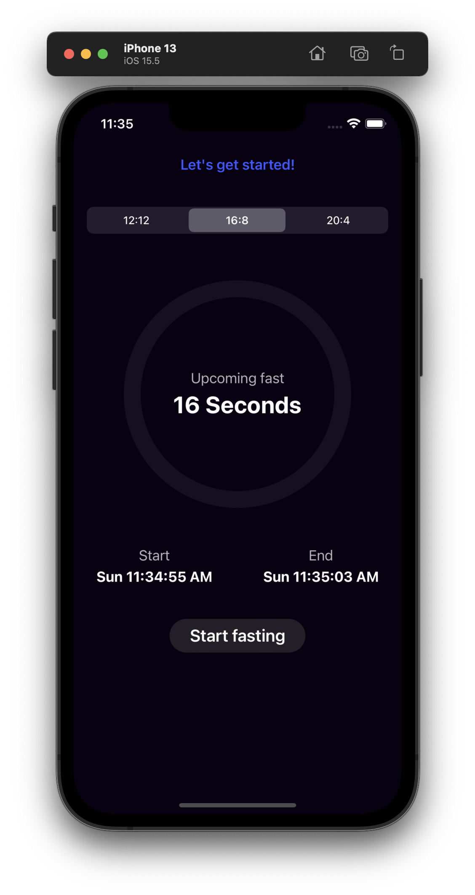
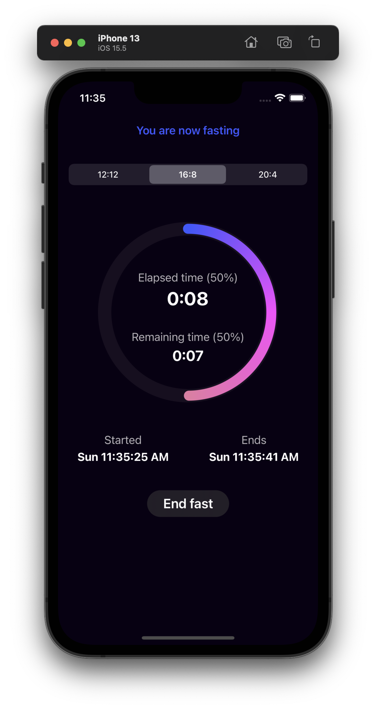
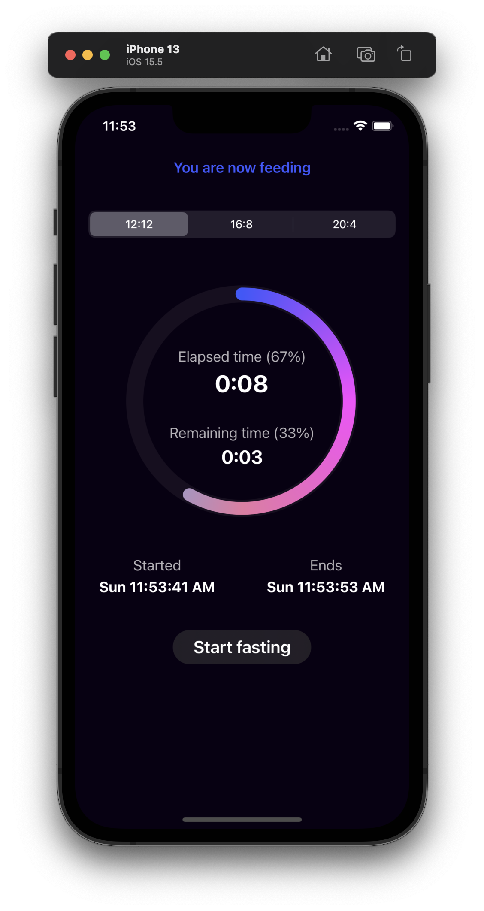
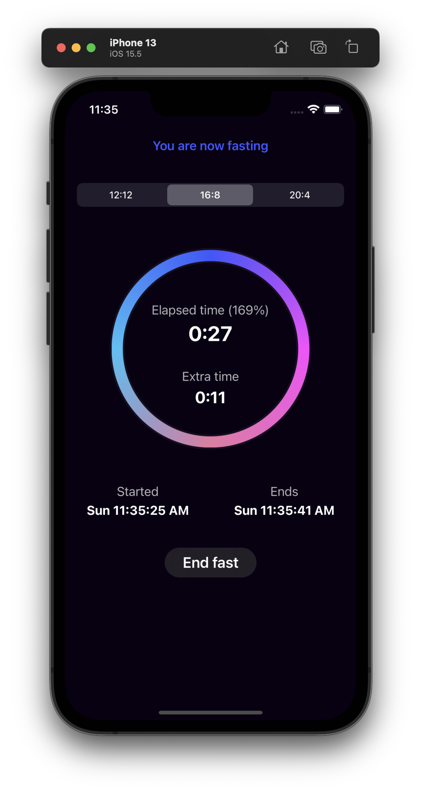

# FastingTimer

#### Fasting Timer App builded with SwiftUI

###### The timers count the time that you are fasting and the time that you are feeding. When you are at the feeding state, all the timers count the feeding time of your specific fasting plan, and when you are at the fasting state, all the timers count the fasting time of your specific fasting plan. If the timer exceeds your specific plan's total time, we continue counting it as extra time in your current state until you change it.

---

#### App Demo.
<table>
  <tr>
    <td>Main View</td>
	<td>Fasting View</td>
	<td>Feeding View</td>
	<td>Exceeds Current State View</td>
  </tr>
  <tr>
    <td></td>
	<td></td>
	<td></td>
    <td></td>
  </tr>
</table>

---

Source of the project: [Design Code](https://www.youtube.com/watch?v=pdYTtbOl9YQ)
